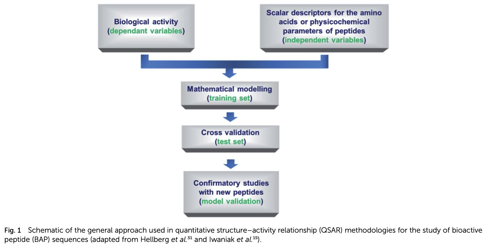

# 实验五：序列表征/数值化2(以定量构效关系建模为例)

## 实验目的
* 1）了解定量构效关系建模的研究背景
* 2）编程实现肽序列的AA531(531 properties of Amino Acids)特征表征/数值化

## 1. 定量构效关系
* 分子是物质的基本组成单位。分子结构属性决定其生理活性。
* 通过统计学、信息学方法从分子结构中提取、总结分子结构的信息与规律，有助于从理论上指导实验过程。
* 定量构效关系(Quantitative Structure-Acitivity Relationship, QSAR)是以分子的基本理化性质与相应的生理活性为基础，通过数学或统计学手段定量研究有机小分子（如抑制剂等）与生物大分子（如受体、酶等）间的相互作用。
* QSAR可用于高效生物活性分子化合物筛选、药物的环境毒性评价、新药设计与合成等[1]。



## 2. ACE抑制剂研究现状
* 血管紧张素转化酶(Angiotensin-Converting Enzyme，ACE)抑制肽是一类从食源性蛋白质中分离得到的具有降高血压活性的多肽。由于其降血压效果好，而且没有降压药物的毒副作用从而引起了广泛关注。
* 近年来，ACE抑制肽的构效关系研究成为研究重点。结构生物信息学研究表明，ACE抑制肽的ACE抑制能力不仅与其分子质量有关，而且与其氨基酸序列以及其立体空间构象之间存在高度相关性。
* ACE抑制肽的抑制类型与ACE抑制活性、构效关系也存在一定相关性。对ACE抑制肽构效关系进行深入研究将有助于指导开发高活性的功能性食品及降血压药物[2]。

## 3. 数据集
* ACE_tri-peptides_150数据集的肽序列及其活性(lg(IC<sub>50</sub>))来源于文献[3].
* [ACEtriPeptidesSequencesActivities.txt](https://github.com/dai0992/Pattern-Recognition-and-Prediction/blob/master/Lab2_SplicingSequencesCoding/EI-true-false_IE-true-false_seq.zip)

## 4. 基于[AA531](http://www.genome.jp/aaindex)的序列表征
* An amino acid index is a set of 20 numerical values representing any of the different physicochemical and biological properties of amino acids. The AAindex1 section of the Amino Acid Index Database is a collection of published indices together with the result of cluster analysis using the correlation coefficient as the distance between two indices. This section currently contains 544 indices.
* 某些氨基酸缺失了部分理化属性，预处理后，符合条件的生理生化属性共531个。
* 对于每条ACE三肽序列，以每个位置氨基酸对应的531个理化属性依次替换序列，获得531x3 = 1593个特征。

## 5. 工作目录准备与Python包准备
```sh
# 建立lab_02文件夹
$ mkdir lab_02
$ cd lab_02

# 首先要安装Python的包管理工具pip
$ curl https://bootstrap.pypa.io/get-pip.py -o get-pip.py   # 下载安装脚本
$ python3 get-pip.py    # 运行安装脚本

# 安装3个常用包：矩阵运算包numpy、数值计算scipy包、矩阵作图包matplotlib
$ pip3 install --user numpy scipy matplotlib -i https://pypi.tuna.tsinghua.edu.cn/simple
```

## 6. 序列表征
* 参考程序：kSpaceCoding.py
* 将以下代码保存为一个.py文件(如kSpaceCoding.py). 程序功能：读取'EI_true1.seq', 计算kSpace特征，并将结果保存至输出文件(如'EI_true1_kSpace.txt')
```python3
import numpy as np # 导入numpy包，并重命名为np

def file2matrix(filename, KMAX, bpTable):
    fr = open(filename) # 打开文件
    arrayOLines = fr.readlines() # 读取所有内容
    fr.close() # 及时关闭文件

    numberOfLines = len(arrayOLines) # 得到文件行数
    returnMat = np.zeros((numberOfLines, 16*(KMAX+1))) # 为返回的结果矩阵开辟内存
    lineNum = 0

    for line in arrayOLines:
        line = line.strip() # 删除空白符，包括行尾回车符
        listFromLine = line.split(': ') # 以': '为分隔符进行切片
        nt_seq = list(listFromLine[1]) # 取出核酸序列并转换成list
        del(nt_seq[70:72]) # 删除位于第71，72位的供体位点
        
        kSpaceVec = []
        for k in range(KMAX+1): # 计算不同k条件下的kSpace特征
            bpFreq = bpTable.copy() # bpTable是一个字典型变量，一定要用字典的copy函数，Python函数参数使用的址传递

            for m in range(len(nt_seq)-k-1): # 扫描序列，并计算不同碱基对的频率
                bpFreq[nt_seq[m]+nt_seq[m+1+k]] += 1 # 序列的子串会自动在字典中寻找对应的key，很神奇！否则要自己写if语句匹配
            bpFreqVal = list(bpFreq.values()) # 取出bpFreq中的值并转换成list
            kSpaceVec.extend(np.array(bpFreqVal)/(len(nt_seq)-k-1)) # 每个k下的特征，需除以查找的所有子串数

        returnMat[lineNum,:] = kSpaceVec
        lineNum += 1
    return returnMat, lineNum

if __name__ == '__main__':
    filename = 'EI_true1.seq'
    KMAX = 4
    bpTable = {}
    for m in ('A','T','C','G'):
        for n in ('A','T','C','G'):
            bpTable[m+n] = 0

    kSpaceMat, SeqNum = file2matrix(filename, KMAX, bpTable)
    outputFileName = 'EI_true1_kSpace.txt'
    np.savetxt(outputFileName, kSpaceMat, fmt='%g', delimiter=',')
    print('The number of sequences is %d. Matrix of features is saved in %s' % (SeqNum, outputFileName))
```
```sh
# 删除EI_true.seq的头4行描述
$ sed '1,4d' EI_true.seq > EI_true1.seq
# 运行程序（可自行在主函数中更改KMAX的值，观察结果。每次在文件中更改参数很麻烦，可自己上网搜索如何通过命令行传递参数）
$ python3 kSpaceCoding.py
```

## 作业
自己独立编写序列表征程序。不怕报错，犯错越多，进步越快！

## 参考文献
[1] Nongonierma AB, FitzGerald RJ. Learnings from quantitative structure–activity relationship (QSAR) studies with respect to food protein-derived bioactive peptides: a review. RSC advances. 2016, 6(79): 75400-75413. <br>
[2] 王晓丹, 薛璐, 胡志和, 等. ACE抑制肽构效关系研究进展[J]. 食品科学, 2017, 38(5): 305-310. <br>
[3] 刘静, 彭剑秋, 管骁. 基于多元线性回归的血管紧张素转化酶抑制肽定量构效关系建模研究[J]. 分析科学学报, 2012, 28(1): 16-22. <br>
[4] 

## 致谢
剪接位点研究背景，部分摘自湖南农业大学博士学位论文《基于卡方决策表的分子序列信号位点预测》(2019)。<br>
感谢曾莹博士提供其学位论文！
